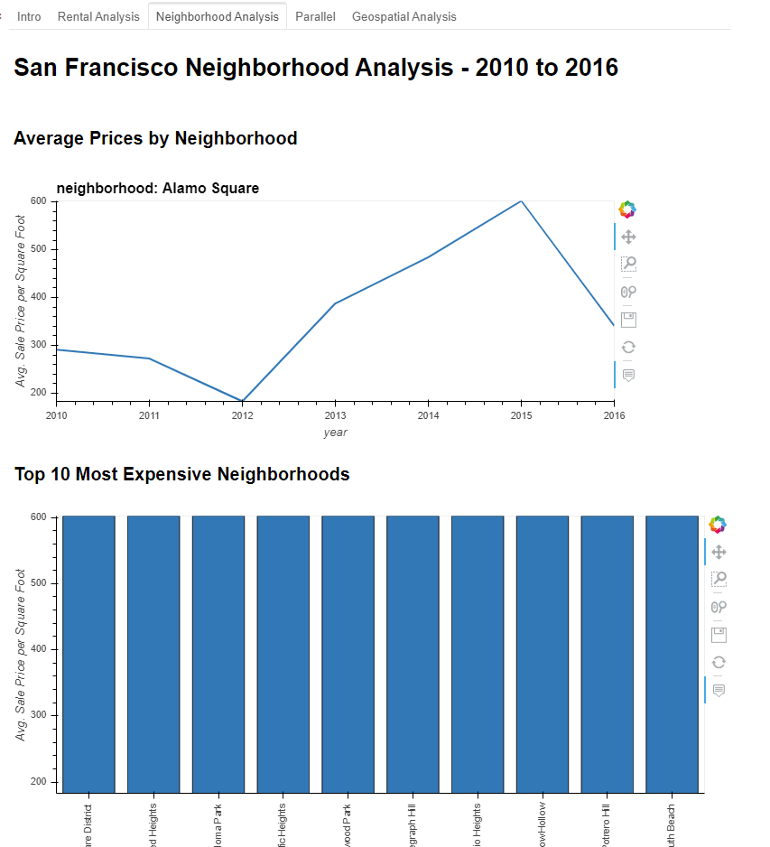

# Unit 6 - Pythonic Monopoly

## The San Francisco Property Analysis Dashboard

The dashboard has 5 tabs as follows:
1) Intro - Containing short message providing context on the dashobaord data.
2) Rental Analysis - 2010 to 2016, containting the follwoing charts:
    - Housing Units Per Year
    - Average Gross Rent Per Year
    - Average Sales Price Per Year
3) Neighborhood Analysis - 2010 to 2016, containting the follwoing charts:
    - Average Prices by Neighborhood
    - Top 10 Most Expensive Neighborhoods
4) Parallel, containting the follwoing charts:
    - Average values per neighborhood - Parallel Coordinates
    - Average values per neighborhood - Parallel Categories 
5) Geospatial Analysis, containting an interactive map with data on average prices per neighborhood. 

